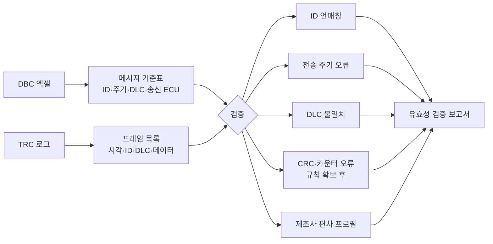

# 차량 CAN 데이터 유효성 검증 Agent — 프로젝트 기획서

| 항목 | 내용 |
|---|---|
| 리포 | data09-13 |
| 제출자 | 양승문 |
| 직무·소속 | 차량 전장 기능품 개발 담당 |
| 과정 | 현장 데이터 디지털화 전문가과정 1차수 |
| 작성일 | 2026-09-28 |
| 문서 상태 | 초안 v0.1 — 수강생 제출 자료 기반 |

---

## 1. 추진 배경과 현안

- 최근 차량 내 통신(CAN 통신) 데이터에 오류가 있었습니다.
- 실차 시험에서 로깅한 CAN 데이터가 설계 기준(CAN DBC)대로 오고 있는지 검증하는 Agent가 필요합니다.
- 기능품 제조사마다 데이터가 약간씩 달라 CAN DBC와 조금 다를 수 있습니다. 이 차이도 확인할 수 있어야 합니다.

현재는 로그 파일(TRC)을 사람이 직접 열어 DBC 문서(엑셀)와 대조하는 것으로 보입니다(가정). 로그는 메시지 수가 많아 눈으로 전송 주기나 ID 누락을 확인하기 어렵습니다(가정).

## 2. 목표

### 2.1 최종 목표

- 실차 CAN 로깅 데이터를 넣으면 DBC 기준으로 자동 검증해 **CAN 데이터 유효성 검증 보고서**(전송 주기 오류, CRC 오류, ID 언매칭 등)를 만들어 주는 도구
- 제조사별로 DBC와 다른 부분을 「오류」와 「제조사 편차」로 구분해 보여 주는 기능

### 2.2 1차 개발 목표

- DBC 엑셀과 TRC 로그를 브라우저에 올리면 **ID 언매칭**, **전송 주기 오류**, **DLC(데이터 길이) 불일치**를 검사해 보고서를 만드는 도구를 먼저 만듭니다.
- **CRC 오류 검사는 계산 규칙(어느 바이트에 어떤 다항식으로 들어가는지)을 받은 뒤** 추가합니다. 규칙 없이는 판정할 수 없기 때문입니다.

## 3. 보유 데이터

| 데이터 | 형태 | 규모·주기 | 비고(민감도 등) |
|---|---|---|---|
| CAN DBC 정리 문서 | Excel | 메시지·신호 수 미상 | 차량 통신 설계 정보 — 사내 기밀. 열 구성 미상(메시지 ID, 이름, 주기, DLC, 송신 ECU, 신호 정의 등이 있을 것으로 가정) |
| 실차 CAN 로깅 데이터 | TRC 파일(텍스트 형식) | 시험마다 생성, 파일 크기·길이 미상 | 실차 시험 데이터 — 사내 기밀. 로깅 장비·TRC 버전 미상(PEAK PCAN 계열 TRC 형식으로 가정) |

제출 원문에 첨부 파일은 없습니다. 두 파일의 샘플이 있어야 파서를 확정할 수 있습니다(10장).

## 4. 해결 방안 개요

| 단계 | 내용 |
|---|---|
| 수집 | DBC 엑셀, 실차 TRC 로그 |
| 정리 | DBC → 메시지 기준표로 정규화 / TRC → 프레임 목록(수신 시각, ID, 방향, DLC, 데이터 바이트)으로 파싱 |
| 분석 | ID별 프레임 수·주기 통계(평균·최소·최대·지터), 기준표와 대조, (규칙 확보 시) CRC·Alive Counter 재계산 |
| AI | 검사 결과를 보고서 문장으로 요약, 제조사 편차로 볼 만한 항목 제안 (확장) |
| 산출물 | 유효성 검증 보고서(요약 + ID별 상세표), 엑셀 내보내기 |

## 5. 주요 기능

| 기능 | 설명 | 우선순위 |
|---|---|---|
| DBC 엑셀 가져오기 | DBC 엑셀을 읽어 메시지 기준표로 변환. 열 이름이 파일마다 다를 수 있어 열 매핑 화면 제공 | MVP |
| TRC 로그 파싱 | TRC 텍스트를 프레임 목록으로 변환. 헤더·주석 줄 건너뛰기, 표준/확장 ID 구분 | MVP |
| ID 언매칭 검사 | 로그에는 있는데 DBC에 없는 ID, DBC에는 있는데 로그에 한 번도 안 나온 ID를 목록화 | MVP |
| 전송 주기 검사 | ID별 실제 주기(평균·최소·최대·지터)를 DBC 주기와 비교해 허용 오차를 넘는 구간 표시. 허용 오차는 사용자가 지정 | MVP |
| DLC 검사 | DBC의 데이터 길이와 실제 프레임 길이가 다른 경우 표시 | MVP |
| 검증 보고서 | 요약(검사 항목별 이상 건수) + ID별 상세표, 엑셀·인쇄용 화면 내보내기 | MVP |
| CRC 검사 | 메시지별 CRC 위치·다항식·초기값·범위를 설정하면 재계산해 불일치 표시 | 확장(규칙 확보 후 1순위) |
| Alive Counter 검사 | 카운터 신호의 증가 규칙 위반(건너뜀·정지) 표시 | 확장 (가정 — 사용 여부 확인 필요) |
| 제조사 편차 프로필 | 제조사별로 알려진 차이(주기 허용폭, 추가 ID 등)를 등록해 「오류」와 「편차」를 구분 | 확장 |
| 신호 값 범위 검사 | DBC의 신호 정의(시작 비트, 길이, 배율, 최소·최대)로 물리값을 계산해 범위 이탈 표시 | 확장 |
| AI 요약 | 검사 결과를 보고서 문장으로 정리 | 확장 |

## 6. 기대 산출물

1. **CAN 로그 검증 도구(브라우저)** — DBC 엑셀 + TRC 로그를 넣으면 검사 실행
2. **CAN 데이터 유효성 검증 보고서** — 전송 주기 오류, CRC 오류, ID 언매칭 등 항목별 요약과 상세
3. **제조사 편차 프로필** — 제조사별 허용 차이 기록 (확장)
4. **코랩용 Python 노트북** — 같은 검사 로직을 대용량 로그나 여러 파일 일괄 처리에 쓰는 판 (가정 — 필요 시)

## 7. 기술 구성

| 과정 도구 | 이 프로젝트에서 쓰는 곳 |
|---|---|
| DAY1 암묵지 자산화·전략기획 | 「이런 경우는 오류가 아니다」 같은 담당자 판정 기준과 제조사별 편차를 규칙으로 꺼내 적기 |
| DAY2 코랩(Python)·바이브코딩 | TRC 파싱, ID별 주기 통계, DBC 대조 로직 시험 — 이 프로젝트의 중심 |
| DAY3 멀티모달 비정형 정보화 | (필요 시) 제조사 사양서 PDF에서 CRC·주기 규칙 추출 |
| DAY4 RAG (Dify, NotebookLM) | 제조사 사양서·과거 불량 사례를 근거로 이상 원인 질의 (확장) |
| DAY5 Make 자동화 | 시험 로그를 공유 폴더에 올리면 검증 후 보고서 메일 발송 (확장, 보안 허용 시) |
| 생성형 AI | 보고서 요약 문장, 편차 판단 보조 |

**개발 형태(권장)**

- **설치 없이 브라우저에서 도는 정적 웹 도구**로 만듭니다. 파일을 브라우저 안에서만 읽고 계산하므로 **차량 통신 설계와 시험 데이터가 외부로 나가지 않습니다.** 검증 자체는 규칙 계산이라 AI 서비스가 필요 없습니다.
- 로그가 매우 크면 브라우저에서 느려질 수 있으므로, 같은 로직을 **코랩용 Python**으로도 제공합니다(가정 — 샘플 크기를 보고 결정).
- AI 요약은 검사 결과 숫자만 넘기는 방식으로 선택 기능으로 둡니다(외부 AI 사용 허용 여부 확인 필요).

## 8. 개발 단계

### 1단계 — 지금 바로 개발 가능한 부분

CAN 통신 검증 규칙 중 **DBC와 로그만 있으면 판정할 수 있는 항목**은 샘플을 받기 전에도 공개된 TRC 형식을 기준으로 먼저 만들 수 있습니다.

- TRC 파서(공개 형식 기준, 버전별 열 차이는 샘플로 확정)와 DBC 엑셀 열 매핑 가져오기
- ID 언매칭 검사(로그에만 있음 / DBC에만 있음)
- 전송 주기 검사(ID별 평균·최소·최대·지터, 허용 오차 사용자 지정)
- DLC 불일치 검사
- 검증 보고서 화면과 엑셀 내보내기
- 시험용으로는 가상의 DBC·로그 샘플을 만들어 일부러 오류(주기 이탈, 미정의 ID, 누락 ID)를 넣어 검사가 잡는지 확인합니다.

### 2단계

- 실제 DBC 엑셀·TRC 샘플로 파서 보정
- CRC 검사(메시지별 CRC 규칙 설정 화면) 및 Alive Counter 검사
- 제조사 편차 프로필: 제조사별 허용 차이를 등록해 「오류」와 「편차」 구분 표시

### 3단계

- 신호 단위 디코딩(물리값 계산)과 값 범위 검사, 시간축 그래프
- 여러 시험 로그 일괄 검증·비교(시험 회차별 추이)
- AI 요약 보고서, 제조사 사양서 기반 원인 질의(Dify), 보고서 자동 배포(Make)

## 9. 기대 효과

- **검증 누락 감소** — 사람이 눈으로 보기 어려운 전 ID의 주기·존재 여부를 빠짐없이 확인합니다.
- **검증 기준 일관화** — 누가 검증해도 같은 DBC 기준과 허용 오차로 판정합니다.
- **제조사 협의 근거 확보** — 제조사별 편차를 기록으로 남겨, 오류인지 사양 차이인지 논의할 때 근거가 됩니다.
- **보고서 작성 시간 단축** — 검사 결과가 보고서 형식으로 바로 나옵니다.

제출 자료에는 정량 수치가 없어 이 문서도 수치를 적지 않습니다.

## 10. 확인 필요 사항

**샘플 데이터 (필수)**

1. CAN DBC 엑셀 샘플 — 열 구성(메시지 ID, 메시지 이름, 주기, DLC, 송신 ECU, 신호 정의 등), 시트 구성
2. TRC 로그 샘플 — 로깅 장비·프로그램 이름과 버전(예: PCAN-View 등 — 가정), 파일 앞부분 헤더, 표준(11비트)/확장(29비트) ID 사용 여부, CAN FD 사용 여부
3. 실제로 오류가 있었던 로그 1건과 그 오류 내용 — 도구가 잡아내는지 확인하는 기준

**검증 규칙**

4. 「CRC 오류」가 가리키는 것 — 데이터 안에 넣은 응용 CRC(메시지별 체크섬 신호)인지, 버스 프레임 CRC 오류(로거가 에러 프레임으로 기록)인지. 응용 CRC라면 메시지별 CRC 위치·다항식·초기값·계산 범위
5. 전송 주기 허용 오차 기준(사내 기준 또는 제조사 사양)
6. Alive Counter 등 다른 무결성 신호를 쓰는지
7. 「ID 언매칭」 외에 보고서에 꼭 들어가야 할 항목과 기존 보고서 양식
8. 제조사별로 DBC와 다른 부분의 실제 예시(어느 제조사, 어떤 차이)

**보안·환경**

9. DBC·로그를 외부 AI나 클라우드(코랩 포함)에 올려도 되는지 — 안 되면 브라우저 전용·로컬 Python으로만 진행
10. 로그 1개 파일의 일반적인 크기·시험 시간

## 부록. 제출 원문 요약

| 출처 | 파일·게시물 | 내용 |
|---|---|---|
| 패들릿 게시물 1 (2026-09-28T07:42) | 「차량 CAN 데이터 유효성 검증 Agent」 — `기획_원문.md` | 직무·소속(차량 전장 기능품 개발 담당), 현안(실차 로깅 CAN 데이터 유효성 검증), 보유 데이터(CAN DBC 엑셀, TRC 로깅 파일), 기대 산출물(전송 주기 오류·CRC 오류·ID 언매칭 검증 보고서), 제조사별 DBC 편차 확인 요청 |

첨부 파일은 제출되지 않았습니다(`attachments.json` 비어 있음).
